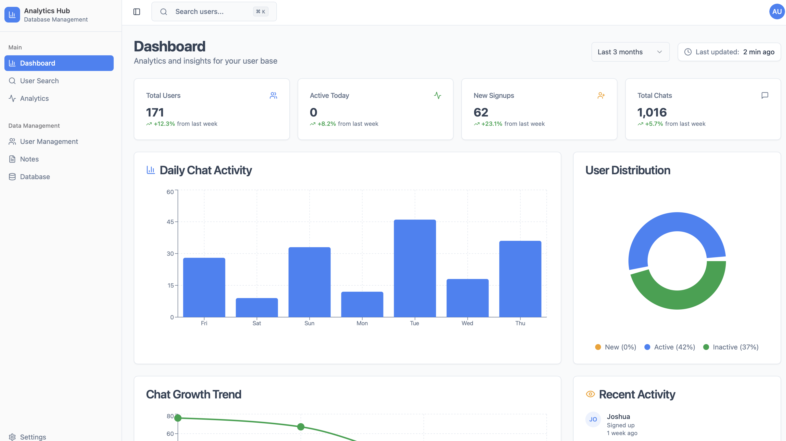

A few weeks ago I wanted better visibility into how families are using [**Toy Boat**](https://toyboat.co) — the app for families to play together from anywhere. Rather than starting from scratch, I tried [**Lovable**](https://lovable.dev/) and ended up building a working analytics dashboard in about an hour during one of [Bethany Crystal's Build First AI workshops](https://buildfirst.ai/events). I had some extra Lovable credits, so why not?

You can see the dashboard live here: [toy-boat-analytics.lovable.app](https://toy-boat-analytics.lovable.app).

## The Setup

I kept the stack intentionally simple and close to the product:

* Uses the same login as [Toy Boat](https://toyboat.co). If you can sign into the app, you can sign into the dashboard.
* Server-side check verifies you're an admin before granting access.
* All data comes directly from Supabase — no separate analytics database to maintain.

This meant I could ship something useful fast, without introducing new systems that would drift out of sync.

## What I Built During the Workshop

In roughly an hour, I had Lovable scaffold the dashboard, wire up auth, and render the first charts: total users, daily chat activity, new signups, user distribution, and recent activity. The starter UI was clean enough that I focused most of my time on queries and getting the numbers right.

## A Little More Polish

After the workshop, I spent a couple more hours tightening things up and adding a [**demo mode**](https://toy-boat-analytics.lovable.app/demo) so I could share the dashboard publicly without exposing private data. Demo mode swaps the data layer for realistic-but-fake numbers while keeping the real UI and interactions.

## Why This Approach Works

* Single source of truth: queries read from Supabase directly; no ETL.
* Familiar login flow: no new accounts for the team to manage.
* Fast iteration: Lovable handled most of the scaffolding so I could spend time on metrics.

Big thanks to [Build First](https://buildfirst.ai/events) for the push to just ship it!

